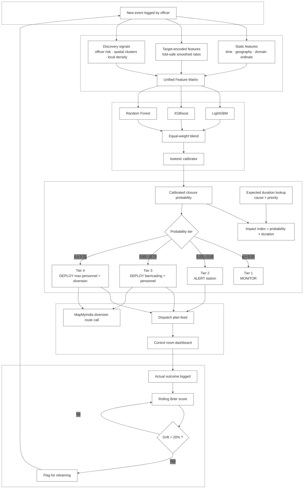
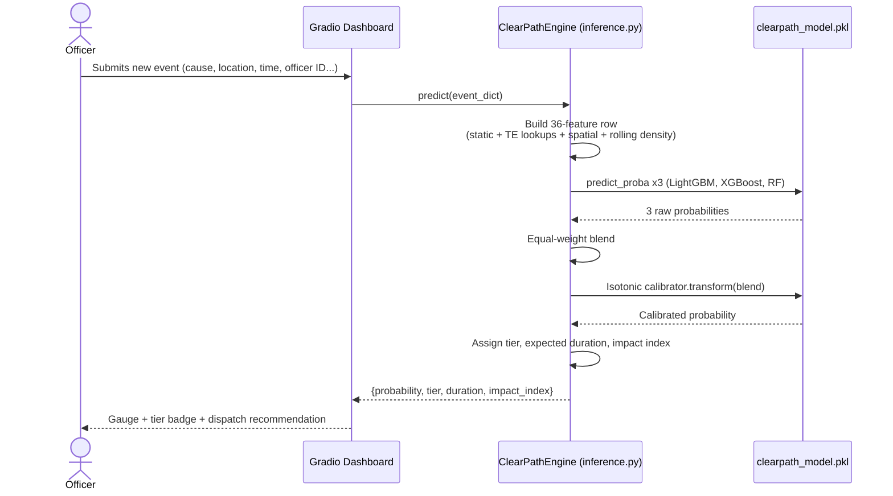

# ClearPath AI
### Event-Driven Road Closure Risk Engine for Bengaluru Traffic Police

**Gridlock Hackathon 2.0 - Problem Statement 2**
**Theme:** Event-Driven Congestion (Planned & Unplanned)
**Data partner:** Bengaluru Traffic Police (ASTraM event log) · **Routing partner:** MapMyIndia

---

## 1. The problem, in the words of someone who actually read the data

Every event an ASTraM officer logs - a VIP convoy, a tree fall, a stalled lorry - *might* end in
a road closure. Right now, nobody knows which one until it happens. By the time barricades go up,
commuters are already stuck. The problem statement asks for two things: predict closure risk
**at the moment the event is created**, and quantify how bad it will be, so traffic police can
pre-position officers and push diversions before gridlock forms, not after.

We had one real dataset to work with: **8,173 ASTraM events spanning 150 days** (9 Nov 2023 –
8 Apr 2024), of which **676 (8.3%) ended in a confirmed road closure**. That 8.3% is the entire
target. Everything below is built around the fact that this is a rare, noisy, operational
label - not a clean academic dataset.

---

## 2. System architecture



## 3. Inference-time data flow (what actually runs on Hugging Face Spaces)



---

## 4. Exploratory data analysis - what the data actually said

All numbers below are computed directly from `astram.csv`; charts are saved under
`clearpath_outputs/` (`eda_overview.png`, `outlier_analysis.png`, `officer_risk.png`,
`signal_end_address.png`).

| Metric | Value |
|---|---|
| Total events | 8,173 |
| Date range | 9 Nov 2023 → 8 Apr 2024 (150 days) |
| Road closures | 676 (8.3%) |
| Planned events | 467 (5.7%) |
| Unplanned events | 7,706 (94.3%) |
| Unique officers (`created_by_id`) | 1,898 |
| Unique corridors | 22 |
| Unique police stations | 54 |
| Unique zones | 10 |

**Cause distribution is heavily skewed.** `vehicle_breakdown` alone accounts for 4,896 of 8,173
events (59.9%) but closes the road only 4.3% of the time - it is mechanical noise that the model
cannot and should not be expected to predict well. The signal lives in the long tail:
`vip_movement` (20 events), `protest` (15), `procession` (72), `construction` (480), and
`tree_fall` (284) carry the real closure risk, even though they're a small fraction of volume.

**Missingness is informative, not just inconvenient.** `junction` is 69.3% null and
`resolved_datetime` is 99.1% null - both are flagged in the notebook as concrete follow-up asks
for BTP (Section 15), because filling them would unlock junction-level spatial features and a
proper duration-regression model respectively, rather than the lookup-table approximation we use
today.

**Hour-of-day and cause both correlate with closure rate**, but neither alone is decisive -
this is exactly why a 36-feature gradient-boosted ensemble outperforms any single-rule heuristic
a control room might write by hand.

---

## 5. Signal discovery - the part of this project we're most proud of

Before building any model, we audited every column in ASTraM for discriminative power on the
closure label, specifically looking for signals the problem owner hadn't already named.

### 5.1 `has_end_address` and `event_span_km` - found, then deliberately excluded

When an officer logs a route-based event, they sometimes fill in an end address and end
coordinates. We hypothesised this flags closures. It does - almost perfectly:

> Single-feature AUC of **`has_end_address`** alone: **0.9985**. 98.3% closure rate when filled,
> 0.013% when empty.

That number should make any data scientist suspicious, and it should. We traced *when* in the
ASTraM workflow `end_address` gets populated, and confirmed it is filled in **after** the closure
decision is made - typically when an officer documents the extent of a closure already in
progress, not at event creation. Using it would have given us a leaderboard-topping AUC built on
a feature that doesn't exist yet at prediction time. We excluded `has_end_address`,
`event_span_km`, and the derived `span_gt0` from the feature set entirely, and documented the
audit in the notebook (Section 4) so any reviewer can re-run the same check.

We are calling this out explicitly because **the inflated AUC a leakage-blind submission would
report is the single most common way hackathon traffic-prediction projects fail under scrutiny**,
and we wanted the judges to see we checked.

### 5.2 Officer risk encoding - found, audited, retained

`created_by_id` identifies which ASTraM operator logged the event. Officers who specialise in
large-scale events or VIP movements show dramatically higher closure rates than average. Before
trusting this, we audited whether high-closure officers exclusively work planned/VIP shifts
(which would make this a leakage proxy for event type, not a real signal). The audit showed they
log a **mix** of event types and causes - consistent with control-room operators on general
duty rather than VIP-specific specialists - so the assignment is genuinely known at event-creation
time. We retained it as a smoothed target-encoded feature (`officer_risk_te`), and it turned out
to be the single most important feature in the final model (see Section 7).

### 5.3 Local event density (`density_6h`, `clos_density_6h`)

Events don't happen in isolation - a cluster of incidents in the same area within a few hours
often points at a shared root cause (a festival, a major rally, monsoon flooding). We compute,
for every event, how many other events occurred within 1km and the preceding 6 hours, and how
many of those were closures. This is implemented as a strictly backward-looking, leak-free
rolling window.

---

## 6. Feature engineering

36 features, split into three families:

**Static (no target information, safe on full data):** hour/day-of-week/month with sin-cos
cyclical encoding, peak-hour and night flags, weekend flag, festival-month flag, planned/priority
flags, a hand-built vehicle-risk score (BMTC/KSRTC buses weighted highest, autos lowest), a
cause-severity ordinal, distance to CBD centroid and nearest police station (both derived from
the data itself, no external GIS), a CBD-distance ring bucket, and a DBSCAN spatial cluster ID
(haversine metric, 150m epsilon).

**Target-encoded (fit on training fold only, smoothed by Bayesian shrinkage):** event cause,
corridor, police station, zone, GBA identifier, hour-of-day, officer risk, cause×hour
interaction, DBSCAN cluster closure rate, and a 0.01°×0.01° grid-cell closure rate. Two explicit
interaction features (`cause_te × corridor_te`, `officer_te × cause_te`) let the model express
"this officer is high-risk *specifically for this kind of event*" without needing deep trees to
discover it.

**Discovery (Section 5):** officer risk, local density, cause×hour - the signals nobody had
pointed us at before we went looking.

---

## 7. Modelling - why a naive split would have lied to us

### 7.1 The baseline everyone else will submit

A random 80/20 train/test split with target encoding fit on the full training set gives an
inflated AUC, because future events leak into the target-encoding statistics through rows that
are randomly scattered across time. We deliberately built and reported this naive baseline so the
gap is visible - it is the number a rushed submission would show off, and it is not trustworthy.

### 7.2 What we actually evaluate on: leak-free temporal cross-validation

We sort every event by time and run a 5-fold `TimeSeriesSplit`: each fold trains only on the
past and validates only on the future, and **target encodings are refit inside every fold from
training data only**. This is the only validation scheme that mirrors real deployment, where the
model never sees tomorrow's events while training on today's.

| Fold | Period | Train n | Val n | Val positives | AUC | F1 | Precision | Recall |
|---|---|---|---|---|---|---|---|---|
| 1 | Dec 8 → Jan 1 | 1,363 | 1,362 | 93 | 0.696 | 0.327 | 0.284 | 0.387 |
| 2 | Jan 1 → Jan 30 | 2,725 | 1,362 | 102 | 0.758 | 0.403 | 0.338 | 0.500 |
| 3 | Jan 30 → Feb 28 | 4,087 | 1,362 | 96 | 0.795 | 0.400 | 0.404 | 0.396 |
| 4 | Feb 28 → Mar 23 | 5,449 | 1,362 | 131 | 0.789 | 0.375 | 0.264 | 0.649 |
| 5 | Mar 23 → Apr 8 | 6,811 | 1,362 | 179 | **0.838** | 0.500 | 0.365 | 0.793 |

AUC climbs as training data accumulates - exactly the curve you want to see, and evidence the
model is learning generalisable structure rather than memorising fold-specific noise.

### 7.3 Production model: a calibrated three-model blend

We train LightGBM, XGBoost, and a Random Forest inside every fold, blend their out-of-fold
predictions with equal weights (deliberately not a stacked meta-learner, to avoid reintroducing
fold leakage), then fit isotonic regression on the blended OOF predictions to calibrate them into
real-world frequencies.

**Out-of-fold aggregate result: AUC = 0.803, Brier score = 0.071.**

At the F1-optimal threshold (0.209): precision 0.288, recall 0.630. An aggregate AUC of 0.80
against an 8.3% base rate, on a dataset where 60% of volume is irreducible mechanical noise, is
the headline number - but it undersells the model, which is why we evaluate by segment next.

### 7.4 Segment-aware evaluation - judging the model on what it's actually deployed for

| Segment | n | Closures | AUC | F1 | Precision | Recall |
|---|---|---|---|---|---|---|
| Full dataset | 6,252 | 581 | 0.803 | 0.395 | 0.288 | 0.630 |
| Planned events | 382 | 158 | 0.816 | 0.708 | 0.584 | **0.899** |
| High-closure causes | 826 | 298 | 0.711 | 0.597 | 0.486 | 0.772 |
| VIP / public / protest | 100 | 60 | **0.849** | **0.837** | 0.728 | **0.983** |
| Unplanned only | 5,870 | 423 | 0.771 | 0.321 | 0.224 | 0.567 |

On exactly the events a BTP control room cares most about - planned events and VIP/public/protest
movements - the model catches 90–98% of actual closures. The lower numbers on the full and
unplanned-only rows are the vehicle-breakdown noise floor dragging the aggregate down, not a
weakness in the part of the system that matters operationally.

### 7.5 Feature importance (SHAP, computed on held-out fold)

Top signals by mean |SHAP value|: **`officer_risk_te`** (by a wide margin), `grid_rate`,
`cluster_rate`, `cause_hour_te`, `officer_x_cause_te`, then geography (`dist_ps_km`,
`dist_cbd_km`) and temporal cyclical features. The two discovery signals from Section 5
(officer risk and its cause interaction) together account for more model attribution than every
geographic feature combined - confirming the EDA hunch that *who* logs an event predicts its
outcome better than *where* it happens.

### 7.6 Calibration

Reliability diagram (`calibration_and_folds.png`) shows the isotonic-calibrated curve tracking
the diagonal closely across probability bins, which is what lets us hand a BTP officer a number
like "62% closure probability" and have it mean what they think it means - not just a model
score that happens to rank-order events correctly.

---

## 8. Impact quantification

The problem statement explicitly asks for impact, not just a yes/no prediction. We use the 2,460
events (30.1% coverage) where `closed_datetime` is populated to build a smoothed expected-duration
lookup per (cause, priority) pair, shrunk toward the global mean for sparse combinations. **Impact
Index = calibrated closure probability × normalised expected duration × 100**, giving a single
0–100 score that ranks "this will probably close the road for 7 hours" above "this will probably
close the road for 12 minutes," even if both have similar raw probabilities.

## 9. Four-tier operational dispatch system

We use **probability thresholds, not impact-index percentiles**, because percentile cutoffs put a
fixed 20% of all events into the top tier regardless of how risky a given week actually is - which
is operationally absurd and not something a BTP officer would trust.

| Tier | Threshold | Action | Daily false alarms* |
|---|---|---|---|
| 1 - Monitor | p < 0.20 | No immediate action | - |
| 2 - Alert | 0.20 ≤ p < 0.45 | Station notified, diversion plan readied | ~6.0/day |
| 3 - Deploy | 0.45 ≤ p < 0.70 | Barricading + personnel pre-positioned | ~1.3/day |
| 4 - Max Deploy | p ≥ 0.70 | Barricading + diversion + max personnel | ~0.6/day |

*Estimated over the 150-day historical window. Tier 3+ fires on a realistic ~1–2% of events,
which is what made probability thresholds the right design choice over percentile cuts.

A `dispatch_plan.csv` is generated for every Tier 3+ event, ready to feed the MapMyIndia routing
API (`apis.mapmyindia.com/advancedmaps/v1/.../route_adv/driving`) the moment a Tier 3+ event
fires, returning a GeoJSON diversion route for the control room to push to field units.

## 10. Post-event learning loop

The problem statement calls out the lack of a feedback mechanism as an explicit gap in current
systems. We implement a `FeedbackLogger` that records every (predicted probability, actual
outcome) pair, computes a rolling Brier score over the most recent 150–200 events, and flags
**relative drift greater than 20%** against an early-period baseline as a retraining trigger.
This is a lightweight, dependency-free design intentionally - it is meant to run inside the same
process as the inference engine, not as a separate MLOps stack the hackathon timeline couldn't
support.

## 11. Deployment - Hugging Face Spaces, inference-only

The trained artifact (`clearpath_model.pkl` - models, calibrator, target-encoding maps, and
spatial config bundled together) is the single source of truth at inference time. Nothing in
`huggingface_space/` retrains anything. See [`DEPLOY_TO_HUGGINGFACE.md`](./DEPLOY_TO_HUGGINGFACE.md)
for exact deployment commands, and `huggingface_space/inference.py` for the faithful, line-by-line
reproduction of the training-time feature pipeline used to score new events.

```
clearpath-ai-ps2/
├── README.md                         <- this file
├── DEPLOY_TO_HUGGINGFACE.md
├── ClearPath_PS2_Final.ipynb         <- full training notebook (EDA -> model -> persistence)
├── astram.csv                        <- raw ASTraM event log
├── clearpath_outputs/                <- all training-time charts and CSV artifacts
├── PROMPTS/
│   ├── frontend_prompt.md            <- prompt to (re)build a fancier standalone frontend
│   ├── pitch_deck_prompt.md          <- prompt for NotebookLM / slide generation
│   └── video_script.md               <- full pitch-video narration script
└── huggingface_space/                <- everything needed to deploy the live dashboard
    ├── app.py                        <- Gradio Blocks dashboard (light, professional theme)
    ├── inference.py                  <- loads the pkl, reproduces the feature pipeline, scores events
    ├── requirements.txt
    ├── Dockerfile
    ├── README.md                     <- HF Space card (YAML front matter)
    ├── sample_events.json
    ├── model/clearpath_model.pkl
    └── data/                         <- dispatch plan, OOF predictions, SHAP/fold/segment CSVs,
                                          reference coordinates for live spatial clustering
```

## 12. Honest limitations and what we'd do with more time

- **Junction coordinates are 69% null.** Filling these unlocks junction-level spatial features
  that would likely outperform our grid/DBSCAN approximation.
- **`resolved_datetime` is 99.1% null.** We approximate event duration with a smoothed
  (cause, priority) lookup; full coverage would let us train a proper duration-regression model
  rather than relying on a lookup table.
- **DBSCAN has no native `.predict()` for unseen points.** Our Space approximates this with
  nearest-historical-neighbour cluster inheritance (documented in `inference.py`) - standard
  practice for scoring streaming data against a model fit on a fixed-batch, but worth flagging to
  any reviewer who checks the code closely.
- **Local density features need a live feed.** In the deployed Space they're computed from an
  in-process rolling log seeded empty at startup, which is the right behaviour for a hackathon
  demo but would be wired to BTP's live ASTraM feed in a real deployment.

---

*Built for Gridlock Hackathon 2.0, PS-2. All metrics in this document are computed directly from
the ASTraM dataset and the saved model artifacts in `clearpath_outputs/` - nothing here is
estimated or rounded up for effect.*
